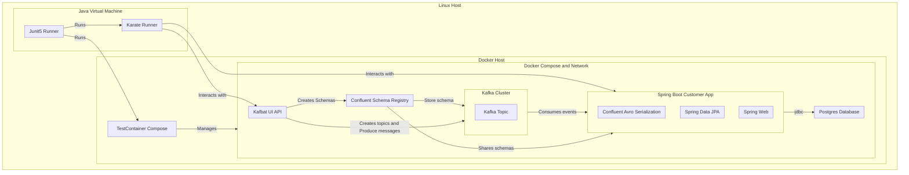

# Simple API REST testing with Karate and Testcontainers
* The following repository uses Karate and Testcontainers to test a simple API REST endpoint + kafka flow.
* The challenge was using HTTP protocol ONLY.

* Contact me on [linkedin](https://www.linkedin.com/in/jean-charles-simonnet-1024/) for more information.

## Schema



What happens during maven test

1. Junits5 runner starts
   1. Before All
      2. Testcontainers starts a Compose "manager" which Boots the following services
         1. Kafka 
         2. Customer-App 
         3. Kafbat UI 
         4. Schema Registry 
         5. Postgres 
   2. Karate runner starts 
      1. sleep 20 seconds to let all compose services finish booting
      2. create a schema through Kafbat UI API
      3. create a topic with enforced validation through Kafbat UI API
      4. produce a message to the topic through Kafbat UI API
      5. sleep 3 seconds to let the message be consumed by the customer-app
      6. read the message customer-app API
      7. assert the message content
   3. After all 
      1. Testcontainers instructs the compose manager to stop all services (compose down --remove-orphans)

## Reference
For further reference, please consider the following sections:


* Testcontainers
  * [Spring Boot Testcontainers support for compose](https://docs.spring.io/spring-boot/docs/3.2.1/reference/html/features.html#features.docker-compose)
  * [Docker compose for testcontainers](https://java.testcontainers.org/modules/docker_compose/)
* [Testing : Karate](https://www.karatelabs.io/api-testing)
* Spring Boot Customer app
  * [Confluent Avro serialization](https://docs.confluent.io/platform/current/schema-registry/fundamentals/serdes-develop/serdes-avro.html)
  * [Spring Web](https://docs.spring.io/spring-boot/docs/3.2.1/reference/htmlsingle/index.html#web)
  * [Spring Data JPA](https://docs.spring.io/spring-boot/docs/3.2.1/reference/htmlsingle/index.html#data.sql.jpa-and-spring-data)
* [Schema Registry](https://docs.confluent.io/platform/current/schema-registry/index.html)
* [Kafka](https://kafka.apache.org/)
* [Kafbat UI Swagger](https://github.com/provectus/kafka-ui/blob/master/kafka-ui-contract/src/main/resources/swagger/kafka-ui-api.yaml)


## Usage

### Build project
```shell
docker build -t customer-app .
```
<details>
  <summary> Logs example </summary>

```shell
[+] Building 396.1s (16/16) FINISHED                                                                                                                                                                                                                                                                                                                                                                                                                                               docker:default
 => [internal] load build definition from Dockerfile                                                                                                                                                                                                                                                                                                                                                                                                                                         0.1s
 => => transferring dockerfile: 367B                                                                                                                                                                                                                                                                                                                                                                                                                                                         0.1s 
 => [internal] load .dockerignore                                                                                                                                                                                                                                                                                                                                                                                                                                                            0.1s 
 => => transferring context: 2B                                                                                                                                                                                                                                                                                                                                                                                                                                                              0.1s 
 => [internal] load metadata for docker.io/library/openjdk:17-alpine                                                                                                                                                                                                                                                                                                                                                                                                                        33.4s 
 => [internal] load metadata for docker.io/library/maven:3.9.5-eclipse-temurin-17-alpine                                                                                                                                                                                                                                                                                                                                                                                                    33.4s 
 => [auth] library/openjdk:pull token for registry-1.docker.io                                                                                                                                                                                                                                                                                                                                                                                                                               0.0s
 => [auth] library/maven:pull token for registry-1.docker.io                                                                                                                                                                                                                                                                                                                                                                                                                                 0.0s 
 => [build 1/6] FROM docker.io/library/maven:3.9.5-eclipse-temurin-17-alpine@sha256:a30f71650b13e5dd376afa423fdf0996e0a8d548cfd1e05e6114ea114c8a3cf5                                                                                                                                                                                                                                                                                                                                         0.0s
 => CACHED [stage-1 1/2] FROM docker.io/library/openjdk:17-alpine@sha256:4b6abae565492dbe9e7a894137c966a7485154238902f2f25e9dbd9784383d81                                                                                                                                                                                                                                                                                                                                                    0.0s 
 => [internal] load build context                                                                                                                                                                                                                                                                                                                                                                                                                                                            0.3s 
 => => transferring context: 8.37kB                                                                                                                                                                                                                                                                                                                                                                                                                                                          0.3s 
 => CACHED [build 2/6] WORKDIR /app                                                                                                                                                                                                                                                                                                                                                                                                                                                          0.0s
 => [build 3/6] COPY pom.xml ./                                                                                                                                                                                                                                                                                                                                                                                                                                                              0.0s 
 => [build 4/6] RUN mvn dependency:resolve                                                                                                                                                                                                                                                                                                                                                                                                                                                 327.4s
 => [build 5/6] COPY src ./src                                                                                                                                                                                                                                                                                                                                                                                                                                                               0.0s
 => [build 6/6] RUN mvn clean package -DskipTests                                                                                                                                                                                                                                                                                                                                                                                                                                           32.7s
 => [stage-1 2/2] COPY --from=build /app/target/*.jar app.jar                                                                                                                                                                                                                                                                                                                                                                                                                                0.1s
 => exporting to image                                                                                                                                                                                                                                                                                                                                                                                                                                                                       0.6s
 => => exporting layers                                                                                                                                                                                                                                                                                                                                                                                                                                                                      0.6s
 => => writing image sha256:9f222c41460575612847ebde5294f019b9281ee56cfac9f4cd0874e48d2f122f                                                                                                                                                                                                                                                                                                                                                                                                 0.0s
 => => naming to docker.io/library/customer-app                        
```
</details>

### Run test ( requires built customer-app image)
```shell
mvn test -Dtest=CustomerControllerTest
``` 
<details>
  <summary> Logs example </summary>

```shell
[INFO] Scanning for projects...
[INFO] 
[INFO] -----------------< com.example:testcontainers-simple >------------------
[INFO] Building testcontainers-simple 0.0.1-SNAPSHOT
[INFO] --------------------------------[ jar ]---------------------------------
[INFO] 
[INFO] --- avro-maven-plugin:1.11.3:schema (schemas) @ testcontainers-simple ---
[INFO] 
[INFO] --- avro-maven-plugin:1.11.3:protocol (schemas) @ testcontainers-simple ---
[INFO] 
[INFO] --- avro-maven-plugin:1.11.3:idl-protocol (schemas) @ testcontainers-simple ---
[INFO] 
[INFO] --- maven-resources-plugin:3.3.1:resources (default-resources) @ testcontainers-simple ---
[INFO] Copying 1 resource from src/main/resources to target/classes
[INFO] Copying 2 resources from src/main/resources to target/classes
[INFO] 
[INFO] --- maven-compiler-plugin:3.11.0:compile (default-compile) @ testcontainers-simple ---
[INFO] Nothing to compile - all classes are up to date
[INFO]
[INFO] --- maven-resources-plugin:3.3.1:testResources (default-testResources) @ testcontainers-simple ---
[INFO] Copying 6 resources from src/test/resources to target/test-classes
[INFO] 
[INFO] --- maven-compiler-plugin:3.11.0:testCompile (default-testCompile) @ testcontainers-simple ---
[INFO] Nothing to compile - all classes are up to date
[INFO]
[INFO] --- maven-surefire-plugin:3.2.5:test (default-test) @ testcontainers-simple ---
[INFO] Using auto detected provider org.apache.maven.surefire.junitplatform.JUnitPlatformProvider
[INFO] 
[INFO] -------------------------------------------------------
[INFO]  T E S T S
[INFO] -------------------------------------------------------
[INFO] Running com.example.testcontainerssimple.CustomerControllerTest
09:46:36.126 [main] INFO org.testcontainers.images.PullPolicy -- Image pull policy will be performed by: DefaultPullPolicy()
09:46:36.145 [main] INFO org.testcontainers.utility.ImageNameSubstitutor -- Image name substitution will be performed by: DefaultImageNameSubstitutor (composite of 'ConfigurationFileImageNameSubstitutor' and 'PrefixingImageNameSubstitutor')
09:46:37.353 [main] INFO org.testcontainers.dockerclient.DockerClientProviderStrategy -- Loaded org.testcontainers.dockerclient.UnixSocketClientProviderStrategy from ~/.testcontainers.properties, will try it first
09:46:38.831 [main] INFO org.testcontainers.dockerclient.DockerClientProviderStrategy -- Found Docker environment with local Unix socket (unix:///var/run/docker.sock)
09:46:38.835 [main] INFO org.testcontainers.DockerClientFactory -- Docker host IP address is localhost
09:46:38.868 [main] INFO org.testcontainers.DockerClientFactory -- Connected to docker:
  Server Version: 24.0.6
  API Version: 1.43
  Operating System: Ubuntu 22.04.2 LTS
  Total Memory: 15648 MB
09:46:38.868 [main] INFO org.testcontainers.DockerClientFactory -- Checking the system...
09:46:38.870 [main] INFO org.testcontainers.DockerClientFactory -- ✔︎ Docker server version should be at least 1.6.0
09:46:38.953 [main] INFO tc.testcontainers/ryuk:0.5.1 -- Creating container for image: testcontainers/ryuk:0.5.1
09:46:39.445 [main] INFO tc.testcontainers/ryuk:0.5.1 -- Container testcontainers/ryuk:0.5.1 is starting: a516d0bcea2f7ba68dc22c47394688543a31b350836f9029a7e13d58d9490966
09:46:43.802 [main] INFO tc.testcontainers/ryuk:0.5.1 -- Container testcontainers/ryuk:0.5.1 started in PT4.84950881S
09:46:43.889 [main] INFO tc.docker/compose:1.29.2 -- Creating container for image: docker/compose:1.29.2
09:46:54.314 [main] INFO tc.docker/compose:1.29.2 -- Container docker/compose:1.29.2 is starting: ea30f77fe85eae2f98ab730d5f7e02c451ac6fd73a9aaa52a8c56588c72f25d5
09:47:26.070 [main] INFO tc.docker/compose:1.29.2 -- Container docker/compose:1.29.2 started in PT42.1812996S
09:47:26.079 [main] INFO tc.docker/compose:1.29.2 -- Docker Compose container is running for command: up -d
09:47:26.083 [main] INFO tc.docker/compose:1.29.2 -- Docker Compose has finished running
09:47:26.087 [docker-java-stream--2023330247] INFO tc.docker/compose:1.29.2 -- STDERR: Creating network "cvrjjs6i81ml_default" with the default driver
09:47:26.087 [docker-java-stream--2023330247] INFO tc.docker/compose:1.29.2 -- STDERR: Creating kafka ...
09:47:26.087 [docker-java-stream--2023330247] INFO tc.docker/compose:1.29.2 -- STDERR: Creating postgres ...
09:47:26.087 [docker-java-stream--2023330247] INFO tc.docker/compose:1.29.2 -- STDERR: Creating postgres ... done
09:47:26.088 [docker-java-stream--2023330247] INFO tc.docker/compose:1.29.2 -- STDERR: Creating kafka    ... done
09:47:26.088 [docker-java-stream--2023330247] INFO tc.docker/compose:1.29.2 -- STDERR: Creating schema-registry ...
09:47:26.088 [docker-java-stream--2023330247] INFO tc.docker/compose:1.29.2 -- STDERR: Creating schema-registry ... done
09:47:26.088 [docker-java-stream--2023330247] INFO tc.docker/compose:1.29.2 -- STDERR: Creating customer-app    ...
09:47:26.088 [docker-java-stream--2023330247] INFO tc.docker/compose:1.29.2 -- STDERR: Creating kafbat-ui       ...
09:47:26.088 [docker-java-stream--2023330247] INFO tc.docker/compose:1.29.2 -- STDERR: Creating kafbat-ui       ... done
09:47:26.088 [docker-java-stream--2023330247] INFO tc.docker/compose:1.29.2 -- STDERR: Creating customer-app    ... done
09:47:42.493 [main] INFO com.intuit.karate -- karate.env system propertiy was: null 
09:47:42.503 [main] INFO com.intuit.karate -- karate.config was: {
  "baseUrl": "http://localhost:8079",
  "kafbatUiUrl": "http://localhost:8080"
}

09:48:05.781 [main] INFO com.intuit.karate -- [print] {
  "partition": 0,
  "keySerde": "String",
  "valueSerde": "SchemaRegistry",
  "key": "{\"id\":1}",
  "content": "{\"id\":{\"int\":1},\"name\":{\"string\":\"John Doe\"},\"email\":{\"string\":\"jone@dot.com\"}}"
}

---------------------------------------------------------
feature: classpath:features/customer.feature
scenarios:  1 | passed:  1 | failed:  0 | time: 28.1768
---------------------------------------------------------

Karate version: 1.4.1
======================================================
elapsed:  44.92 | threads:    1 | thread time: 28.18
features:     1 | skipped:    0 | efficiency: 0.63
scenarios:    1 | passed:     1 | failed: 0
======================================================

HTML report: (paste into browser to view) | Karate version: 1.4.1
file:///mnt/c/Users/Jean-Charles/IdeaProjects/dkat/personal/karate-kafka-ui-gitlab/testcontainers-karate-simple-main/testcontainers-karate-simple-main/target/karate-reports/karate-summary.html
===================================================================

09:48:13.760 [main] INFO tc.docker/compose:1.29.2 -- Creating container for image: docker/compose:1.29.2
09:48:14.087 [main] INFO tc.docker/compose:1.29.2 -- Container docker/compose:1.29.2 is starting: 929e0e5ba207cfe7b6789be4596907acb953d6007fd4a9a11c41352165b891a1
09:49:35.297 [main] INFO tc.docker/compose:1.29.2 -- Container docker/compose:1.29.2 started in PT1M21.536574938S
09:49:35.298 [main] INFO tc.docker/compose:1.29.2 -- Docker Compose container is running for command: down -v
09:49:35.299 [main] INFO tc.docker/compose:1.29.2 -- Docker Compose has finished running
09:49:35.299 [docker-java-stream--685188613] INFO tc.docker/compose:1.29.2 -- STDERR: Stopping kafbat-ui       ...
09:49:35.299 [docker-java-stream--685188613] INFO tc.docker/compose:1.29.2 -- STDERR: Stopping customer-app    ...
09:49:35.299 [docker-java-stream--685188613] INFO tc.docker/compose:1.29.2 -- STDERR: Stopping schema-registry ...
09:49:35.299 [docker-java-stream--685188613] INFO tc.docker/compose:1.29.2 -- STDERR: Stopping kafka           ...
09:49:35.299 [docker-java-stream--685188613] INFO tc.docker/compose:1.29.2 -- STDERR: Stopping postgres        ...
09:49:35.299 [docker-java-stream--685188613] INFO tc.docker/compose:1.29.2 -- STDERR: Stopping customer-app    ... done
09:49:35.299 [docker-java-stream--685188613] INFO tc.docker/compose:1.29.2 -- STDERR: Stopping kafbat-ui       ... done
09:49:35.299 [docker-java-stream--685188613] INFO tc.docker/compose:1.29.2 -- STDERR: Stopping postgres        ... done
09:49:35.299 [docker-java-stream--685188613] INFO tc.docker/compose:1.29.2 -- STDERR: Stopping schema-registry ... done
09:49:35.300 [docker-java-stream--685188613] INFO tc.docker/compose:1.29.2 -- STDERR: Stopping kafka           ... done
09:49:35.300 [docker-java-stream--685188613] INFO tc.docker/compose:1.29.2 -- STDERR: Removing kafbat-ui       ...
09:49:35.300 [docker-java-stream--685188613] INFO tc.docker/compose:1.29.2 -- STDERR: Removing customer-app    ...
09:49:35.300 [docker-java-stream--685188613] INFO tc.docker/compose:1.29.2 -- STDERR: Removing schema-registry ...
09:49:35.300 [docker-java-stream--685188613] INFO tc.docker/compose:1.29.2 -- STDERR: Removing kafka           ... 
09:49:35.300 [docker-java-stream--685188613] INFO tc.docker/compose:1.29.2 -- STDERR: Removing postgres        ...
09:49:35.300 [docker-java-stream--685188613] INFO tc.docker/compose:1.29.2 -- STDERR: Removing postgres        ... done
09:49:35.300 [docker-java-stream--685188613] INFO tc.docker/compose:1.29.2 -- STDERR: Removing kafbat-ui       ... done
09:49:35.300 [docker-java-stream--685188613] INFO tc.docker/compose:1.29.2 -- STDERR: Removing schema-registry ... done
09:49:35.300 [docker-java-stream--685188613] INFO tc.docker/compose:1.29.2 -- STDERR: Removing customer-app    ... done
09:49:35.300 [docker-java-stream--685188613] INFO tc.docker/compose:1.29.2 -- STDERR: Removing kafka           ... done
09:49:35.300 [docker-java-stream--685188613] INFO tc.docker/compose:1.29.2 -- STDERR: Removing network cvrjjs6i81ml_default
[INFO] Tests run: 1, Failures: 0, Errors: 0, Skipped: 0, Time elapsed: 179.6 s -- in com.example.testcontainerssimple.CustomerControllerTest
[INFO] 
[INFO] Results:
[INFO]
[INFO] Tests run: 1, Failures: 0, Errors: 0, Skipped: 0
[INFO]
[INFO] ------------------------------------------------------------------------
[INFO] BUILD SUCCESS
[INFO] ------------------------------------------------------------------------
[INFO] Total time:  03:29 min
[INFO] Finished at: 2024-08-08T09:49:35+02:00
[INFO] ------------------------------------------------------------------------
```
</details>


### Boot infrastructure only (dev purpose)
```shell
docker-compose -f docker/docker-compose-kafka.yml up --scale customer-app=0
```


### Drop infrastructure
```shell
 docker-compose -f docker/docker-compose-kafka.yml down --remove-orphans
```